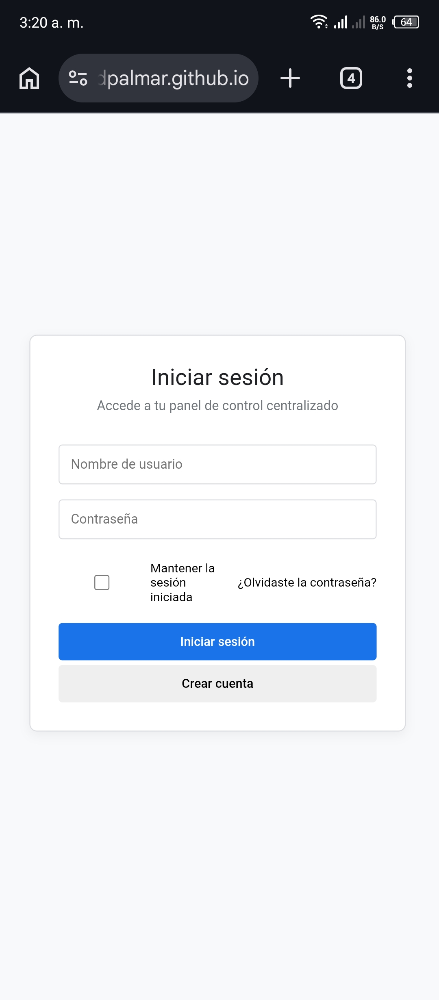
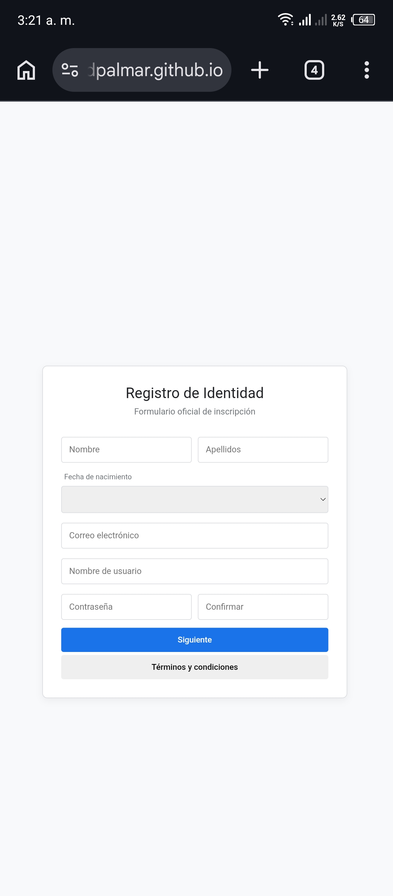
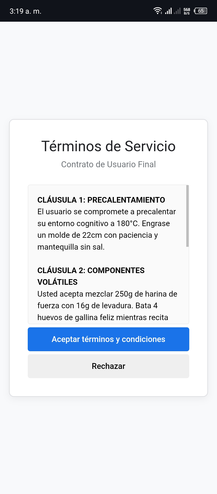
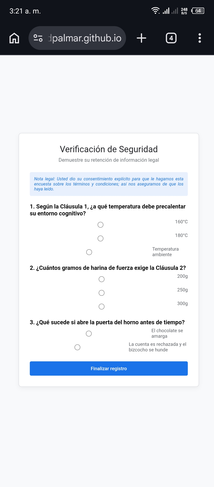

# 📝 The Terms & Conditions Trap
### *Simulador de Burocracia Digital y Comprensión Lectora*

[](https://opensource.org/licenses/MIT)
[](#)

Este proyecto es un **portal de registro ficticio** diseñado para demostrar, mediante la psicología del diseño y la saturación de información, cómo los usuarios tienden a ignorar los términos y condiciones antes de aceptar un servicio.

---

## ⚠️ AVISO IMPORTANTE (DISCLAIMER)

> **Este formulario es TOTALMENTE FALSO.**
> 
> * **No existe una base de datos:** El proyecto no cuenta con backend ni almacenamiento. Los datos introducidos son procesados localmente por el navegador y se pierden al cerrar o recargar la página.
> * **Privacidad:** Por seguridad, **NO introduzcas información personal delicada** (nombres reales, correos electrónicos de uso diario o contraseñas privadas). 
> * **Finalidad:** Este repositorio ha sido creado exclusivamente con fines de **entretenimiento** y para exponer de forma satírica el hábito de "saltarse la lectura" en internet.

---

## 🧠 El Concepto: La Trampa del Bizcocho

La mayoría de los usuarios hacen clic en "Aceptar" de forma mecánica. Para probar este punto, el formulario oculta una **receta técnica de un bizcocho** dentro de las cláusulas legales.

### El flujo del engaño:
1. **Diseño Corporativo:** Estética limpia y profesional que genera una falsa sensación de seguridad.
2. **La Receta Infinita:** Términos de servicio que parecen legales pero detallan temperaturas de horneado y mezclas de harina.
3. **El Consentimiento Invisible:** Una nota al pie advierte que, al aceptar, el usuario consiente ser examinado sobre la lectura.
4. **El Examen Final:** Si el usuario no leyó (o no memorizó) los datos de la receta, el sistema **anula el registro y borra todo el progreso**, obligando al usuario a empezar de cero.

---

## 📸 Capturas de Pantalla

*Aquí puedes ver el diseño adaptable del portal:*

| Pantalla de Inicio | Formulario de Registro |
|---|---|
|  |  |

| Términos (La Receta) | El Cuestionario de Verificación |
|---|---|
|  |  |

---

## 🛠️ Tecnologías Utilizadas

El proyecto es 100% estático, lo que garantiza que sea ligero y seguro:

* **HTML5:** Estructura de pantallas y formularios.
* **CSS3:** Diseño responsivo (Mobile-First) con variables personalizadas y transiciones suaves.
* **JavaScript (Vanilla):** Lógica de navegación, sistema de modales personalizados y validación de respuestas.

---

## 🚀 Instalación

No requiere configuración de servidor ni bases de datos:

1. Clona este repositorio:
   ```bash
   git clone [https://github.com/tu-usuario/terms-trap.git](https://github.com/tu-usuario/terms-trap.git)
   
